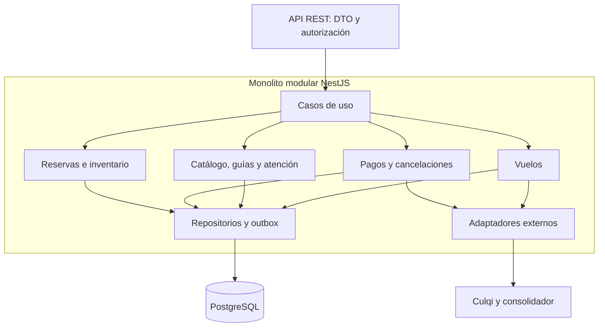

# 07 · Arquitectura monolítica modular

## Decisión y alcance

DM GO Travel se construirá como un **monolito modular NestJS**, dividido por capacidades del negocio y organizado por capas. Los módulos comparten una base PostgreSQL y se versionan conjuntamente. La PWA Next.js es una aplicación cliente; PostgreSQL, Redis, Culqi y el consolidador son dependencias externas al proceso del monolito.

La separación de API y worker responde al tipo de ejecución, no a una fragmentación del dominio. Ambos se obtienen de la misma imagen y liberación. No se incorporan bases independientes por módulo ni llamadas HTTP entre módulos internos.

## Capas y dependencias

| Capa | Responsabilidad | Ejemplos | Restricción |
| --- | --- | --- | --- |
| Presentación | Exponer contratos, validar formato y aplicar guards | Controllers REST, DTO, filtros de error, OpenAPI | No decide cupos ni precios |
| Aplicación | Orquestar casos de uso, transacciones y permisos | Crear hold, confirmar pago, emitir boleto | Depende de interfaces de dominio e infraestructura |
| Dominio | Mantener invariantes y transiciones | Capacidad, reserva, asignación, política de cancelación | Sin dependencia directa de SDK de proveedor |
| Infraestructura | Persistir y conectar sistemas | Repositorios SQL, CulqiAdapter, GdsAdapter, Redis, outbox | Implementa puertos definidos por casos de uso |

## Módulos del monolito

| Módulo | Responsabilidad | Datos principales | Interfaces internas |
| --- | --- | --- | --- |
| Identidad | Perfil, roles y pertenencia a agencia | Users, Memberships | AuthorizeActor |
| Catálogo | Tours, paquetes, itinerarios y fotografías | Tours, Media | GetPublishedTour |
| Inventario | Salidas, capacidad, cierre y holds | Departures, CapacityLedger | AcquireCapacity, ReleaseCapacity |
| Reservas | Viajeros, snapshot comercial y ciclo de reserva | Reservations, Passengers | CreateHold, ConfirmReservation |
| Pagos | Intentos, cargos, conciliación y devolución | Payments, Refunds, WebhookInbox | StartPayment, ReconcilePayment |
| Vuelos | Cotización, localizador y emisión | FlightQuotes, FlightBookings, Tickets | QuoteFlight, IssueTicket |
| Guías | Agenda y asignaciones sin conflicto | Guides, GuideAssignments | AssignGuide |
| Atención | Mensajería y solicitud de cancelación | Threads, Messages, CancellationRequests | RequestCancellation |
| Reseñas | Opiniones elegibles y moderación | Reviews | PublishReview |
| Geografía | Puntos de encuentro, atractivos y rutas | Places, Routes | SearchPlaces |
| Notificaciones | Plantillas y entregas multicanal | Notifications, DeliveryAttempts | EnqueueNotification |
| Reportes y auditoría | Indicadores y trazabilidad | ReadModels, AuditEvents | GenerateReport, RecordAudit |

## Vista lógica

## Comunicación interna y eventos

Las operaciones que necesitan respuesta inmediata llaman interfaces de aplicación dentro del proceso. Las acciones diferidas generan un evento en la **outbox transaccional**, insertado junto con el cambio de negocio. Un dispatcher publica trabajos en BullMQ; el worker ejecuta los handlers del mismo monolito.

Ejemplos de eventos internos: `ReservationHeld`, `PaymentVerified`, `ReservationConfirmed`, `HoldExpired`, `RefundRequested`, `FlightTicketIssued`. Son nombres de diseño, no nombres asumidos del protocolo Culqi.

La entrega es al menos una vez. Cada consumidor conserva una clave de procesamiento para tolerar duplicados. El dispatcher marca publicación después de obtener aceptación de la cola; una caída entre aceptación y marca puede repetir la publicación, por lo que la deduplicación es obligatoria.

## Consistencia de cupos

La salida mantiene `capacity`, `held_seats` y `confirmed_seats`, con valores no negativos y suma menor o igual a capacidad. Crear un hold bloquea la fila, libera holds vencidos según la política, comprueba capacidad y guarda reserva, movimiento y evento en una transacción corta.

Confirmar mueve cupos de held a confirmed; expirar libera held; cancelar libera la categoría que corresponda. Todas las rutas bloquean la misma salida y reserva en un orden fijo y comprueban el estado previo. Un scheduler acelera la liberación, pero una escritura también revisa vencimientos: la corrección no depende de que el scheduler llegue a tiempo.

Los contadores y movimientos se modifican juntos. Una conciliación periódica compara contadores contra reservas activas y alerta ante divergencias; no corrige automáticamente conflictos financieros sin revisión.

## Organización propuesta del código

| Ruta | Contenido |
| --- | --- |
| `apps/web/` | PWA Next.js y panel según rol |
| `apps/backend/src/modules/<modulo>/presentation/` | Controllers, DTO y guards específicos |
| `apps/backend/src/modules/<modulo>/application/` | Casos de uso y puertos |
| `apps/backend/src/modules/<modulo>/domain/` | Entidades, políticas e invariantes |
| `apps/backend/src/modules/<modulo>/infrastructure/` | Persistencia y adaptadores |
| `apps/backend/src/entrypoints/` | Bootstrap API, worker y tareas programadas |
| `apps/backend/src/shared/` | Contratos técnicos mínimos, correlación y errores |
| `database/migrations/` | Esquema, índices y restricciones |
| `contracts/` | OpenAPI y contratos de eventos versionados |

Esta organización es una propuesta para construcción, no una descripción verificada de las carpetas del repositorio.

## Evolución y compromisos

El monolito facilita transacciones, pruebas y una operación inicial simple. A cambio, exige coordinar liberaciones y evitar que un módulo acceda arbitrariamente a tablas de otro. Se aplican interfaces públicas, restricciones de importación y pruebas de arquitectura.

Primero optimizar índices, caché, límites y réplicas del mismo artefacto. La separación futura de módulos se estudiará con métricas reales y no forma parte de esta decisión inicial.
