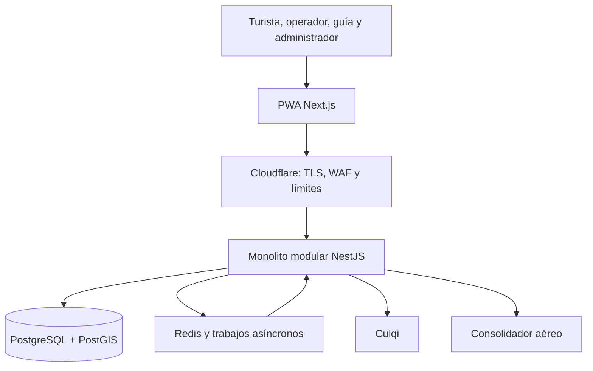

# DM GO Travel · Documentación del sistema

**Sistema de agencia y operadora turística**  
Arquitectura monolítica modular · Reservas consistentes · Pagos Culqi · Despliegue en nube

> **Estado:** propuesta de análisis y diseño arquitectónico. Esta documentación no certifica una implementación ni un despliegue existentes.

## Presentación

DM GO Travel centraliza la publicación de tours, la administración de salidas, la reserva de cupos, el pago en línea y la comercialización de pasajes aéreos. Sustituye la gestión fragmentada mediante mensajería y hojas de cálculo por un proceso trazable que evita sobreventa y relaciona cada cobro con una reserva.

La propuesta se basa en el documento académico **«Sistema de agencia y operadora turística (DM GO Travel)»**, correspondiente al curso Arquitectura de Software, semestre 2026-II, de la Universidad Nacional San Cristóbal de Huamanga. Conserva sus 13 requisitos funcionales, 12 requisitos no funcionales y cuatro roles principales.

## Arquitectura elegida

Un **monolito modular NestJS** concentra las reglas de negocio. La PWA Next.js, la base de datos, la caché y los proveedores externos son elementos de infraestructura o presentación. El proceso de API y el proceso de trabajos usan el mismo código y versión del monolito; no constituyen microservicios de negocio independientes.

**Stack objetivo del PDF:** Next.js + TypeScript + Tailwind CSS; NestJS; PostgreSQL/PostGIS, Auth y Storage en Supabase; Redis compatible con BullMQ; Culqi; FCM; Leaflet/OpenStreetMap; GitHub Actions y Sentry. Cloudflare y la alternativa AWS Lambda se documentan como decisiones complementarias solicitadas.

> El stack objetivo del PDF difiere de Laravel/MariaDB descrito en la conversación previa. Estos documentos definen el diseño propuesto conforme al PDF; no afirman que el repositorio haya sido migrado. No fue posible verificar su contenido actual durante esta elaboración.

## Índice de análisis

| Documento | Contenido |
| --- | --- |
| [01 · Actores](analisis-de-sistema/01-actores.md) | Roles, responsabilidades y permisos |
| [02 · Historias de usuario](analisis-de-sistema/02-historias-del-usuario.md) | Historias y criterios de aceptación |
| [03 · Requisitos funcionales](analisis-de-sistema/03-requisitos-funcionales.md) | RF01–RF13, reglas y alcance |
| [04 · Atributos de calidad](analisis-de-sistema/04-atributos-de-calidad.md) | RNF01–RNF12 y escenarios medibles |
| [05 · Restricciones](analisis-de-sistema/05-restricciones.md) | Límites, dependencias y supuestos |
| [06 · Drivers arquitectónicos](analisis-de-sistema/06-driver-arquitectonicos.md) | Decisiones guiadas por requisitos |
| [07 · Arquitectura monolítica](analisis-de-sistema/07-arquitectura-monolito.md) | Módulos, capas y límites |
| [08 · Despliegue](analisis-de-sistema/08-despliegue-produccion.md) | MVP, operación comercial y Lambda |
| [09 · Culqi](analisis-de-sistema/09-integracion-pasarela-culqi.md) | Cobros, conciliación y reembolsos |

## Vistas y documentación técnica

| Documento | Contenido |
| --- | --- |
| [C4 · Contexto](arquitectura/01-contexto-c4.md) | Personas y sistemas externos |
| [C4 · Contenedores](arquitectura/02-contenedores-c4.md) | Aplicaciones y almacenes |
| [C4 · Componentes](arquitectura/03-componentes-c4.md) | Interior del módulo de reservas |
| [Flujos y estados](arquitectura/04-flujos-y-estados.md) | Reserva, pago, expiración y vuelos |
| [Modelo de datos](arquitectura/05-modelo-de-datos.md) | Entidades, relaciones e integridad |
| [Seguridad y resiliencia](arquitectura/06-seguridad-y-resiliencia.md) | Controles y fallos parciales |
| [Operación y validación](arquitectura/07-operacion-y-validacion.md) | SLO, pruebas y recuperación |
| [Decisiones y trazabilidad](arquitectura/08-decisiones-y-trazabilidad.md) | ADR, cobertura y fases |
| [Fuentes](FUENTES.md) | PDF y documentación técnica |

## Alcance y etapas

La documentación cubre el diseño integral del PDF. El prototipo inicial prioriza identidad, catálogo, cupos, reservas y pagos en sandbox. Los módulos de vuelos, guías, mensajería, mapas, reseñas y reportes conservan sus requisitos y se incorporan por etapas. Un simulador de vuelos permite validar el flujo académico; la venta real exige convenio y API del consolidador.

El PDF excluye una implementación completa en producción, flotas propias, inventario hotelero, itinerarios con IA, múltiples GDS e integraciones formales con OTAs o MINCETUR. El diseño de despliegue comercial se incluye como ruta futura.

## Cómo incorporar estos archivos a GitHub

1. Copiar `analisis-de-sistema/`, `arquitectura/` y `FUENTES.md` al repositorio.
2. Integrar este índice en el README existente o conservar esta portada como `DOCUMENTACION.md` en la raíz para mantener sus enlaces.
3. Confirmar los cambios en Git. GitHub renderiza tablas y bloques Mermaid directamente en los `.md`.

No es necesario subir las imágenes del PDF para visualizar los diagramas reconstruidos. Las figuras son modelos nuevos basados en el documento, con límites del monolito aclarados.
